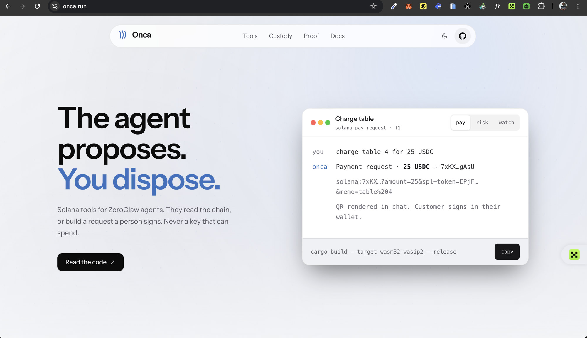

# Onca

Onca is a set of Solana tools for the [ZeroClaw](https://github.com/zeroclaw-labs/zeroclaw)
agent runtime. The tools let an agent handle money. They also keep the agent
safe while it does so.

[](https://onca.run)

Site: [onca.run](https://onca.run) · Source: this monorepo (`site/`)

## The name

Onca comes from *onça*, the Portuguese word for the jaguar. The jaguar is the
largest cat in the Americas and a common sight in Brazil. The name keeps the
claw of ZeroClaw and points it at Solana. We write the name as `Onca`, without
the cedilla, because a plain name is easy to type in a shell and a package. You
say the name as *ON-sah*.

## Why Onca exists

ZeroClaw is a self-hosted agent. It runs as one Rust binary on your own machine,
with your model and your keys. This design is the strength of ZeroClaw. It is
also the risk.

When an agent can move money, the model becomes a path to your wallet. The model
reads messages, mail, and web pages that you do not control. An attacker can
hide an instruction in that text. A private key behind a model is a hot wallet
with an attack surface.

Onca answers this risk directly. Each tool stays at the safe end of the custody
ladder. The agent makes a proposal. A person, a multisig, or a limited session
key approves it. A tool does one of two things: it reads the chain and reports,
or it builds an unsigned request for a person to sign. No tool in Onca holds a
key that can spend funds. The rules that keep this true live in plain Rust that
the model cannot change. [docs/custody.md](docs/custody.md) explains the ladder
and the threat model for the whole suite.

## The tools

| Component | Tier | Holds | What it does |
|---|---|---|---|
| [`onca-core`](crates/onca-core) | — | nothing | The shared Solana library: base58, pubkey, JSON-RPC, amount math, and hand-rolled transaction assembly (memo, durable nonce). Pure Rust, no input or output. Every plugin uses it. |
| [`solana-pay-request`](plugins/solana-pay-request) | T1 | nothing | Turns a request such as "charge table 4 for 25 USDC" into a Solana Pay URL and QR code. A person signs it. |
| [`token-risk-check`](plugins/token-risk-check) | T0 | RPC key | Reads a mint and gives a red, amber, or green verdict: authorities, Token-2022 traps, and holder concentration. |
| [`payment-watch`](plugins/payment-watch) | T0 | RPC key | Watches a Solana Pay reference and confirms that an invoice was paid: the right amount, to the right wallet. |
| [`depin-attest`](plugins/depin-attest) | T1 | nothing | Turns a sensor reading into an unsigned attestation transaction with a replay guard. A ZeroClaw device becomes a Solana-reporting DePIN node. |

Read the tiers this way. A T0 tool reads and reports. A T1 tool builds a request
that a person signs. Onca has no T2 tool. A T2 tool signs and sends. That tier
is where one successful attack empties a wallet, and no tool here needs it.

The plugins reach from payments to the physical edge. `solana-pay-request` asks
for money. `payment-watch` confirms it arrived. `token-risk-check` stops the
agent before it touches a bad token. `depin-attest` lets a device report a
sensor reading to Solana. All of them build on `onca-core`, and none of them
holds a key that can spend.

## The core

The usual way to touch Solana from Rust is `solana-sdk`. As of mid-2026 the
modular Solana crates (`solana-pubkey`, `solana-instruction`, `solana-message`,
`solana-transaction`, `solana-hash`) — and `solana-sdk` itself — compile cleanly
for `wasm32-wasip2`, so a plugin no longer *has* to hand-roll anything to build a
transaction. `onca-core` still assembles transactions by hand, on purpose: a
minimal component with the fewest dependencies, and an encoding proven against
the real runtime rather than only against a library the ZeroClaw host has not yet
instantiated as a component.

That proof is the point. `cargo run --example memo_tx` emits an unsigned
transaction; devnet `simulateTransaction` deserializes it, recognizes the fee
payer as signer, and runs the SPL Memo program. The bytes are correct at the
wire, not only in unit tests (which also check RFC 4648 base64 and the documented
compact-u16 vectors). The core is a plain library with no input or output: it
parses an address, builds a JSON-RPC request, reads the response, shapes amounts,
and assembles the legacy message, the SPL Memo instruction, and the durable-nonce
advance that keeps an approval-gated transaction valid while a human takes their
time to sign (the bounty's blockhash-expiry trap). Wrapping the modular crates
instead is a reasonable future direction; hand-rolling buys minimal size and a
runtime-verified path today. The one thing the core does not do is make the HTTP
call. A trait does that:

```rust
pub trait RpcTransport {
    fn post_json(&self, url: &str, body: &str) -> onca_core::Result<String>;
}
```

Each plugin gives the trait a real client. On wasm, the plugin uses the
[`waki`](https://crates.io/crates/waki) client, and the host does TLS. The tests
give the trait a mock. Because the trait is the only seam, the full RPC layer
runs under `cargo test` on the host with no network. The tests check behavior,
not only text. [docs/wasm-notes.md](docs/wasm-notes.md) records what was hard
about `wasm32-wasip2`.

## The shape of each plugin

Every plugin uses the same split. The bounty requires it, and it is also the
correct design:

```
src/<logic>.rs   pure Rust. All checks and policy. No wasm. The host tests it.
src/lib.rs       a thin wasm shim. It connects the logic to the tool-plugin world.
tests/           host tests over the pure core. The RPC is a mock.
manifest.toml    name, version, capabilities, and the fewest permissions that work.
README.md        what the tool does, its config, its custody tier, its threat model.
```

The split has a purpose beyond order. The rules that limit the tool, such as a
spend cap, a mint allowlist, and address checks, live in the pure core. They run
on every call. The model never sees the config that limits it, and it cannot
turn the config off. To pass a rule, you would have to change the code and build
the component again. At that point you are the operator, not the attacker.

## Build and test

You can test everything on the host. You do not need a wasm toolchain or a
network:

```bash
cd crates/onca-core           && cargo test
cd plugins/solana-pay-request && cargo test
cd plugins/token-risk-check   && cargo test
cd plugins/payment-watch      && cargo test
```

To build one component:

```bash
rustup target add wasm32-wasip2
cd plugins/solana-pay-request
cargo build --target wasm32-wasip2 --release
```

[docs/install.md](docs/install.md) is the full guide for an operator.

## Status

The core and all four plugins are complete: each has a pure Rust core, a wasm
component that builds clean for `wasm32-wasip2`, host tests with a fail-closed
prompt-injection case, a manifest with the fewest permissions, and a README with
a threat model.

The tools are the means, not the submission. The submission is a running use
case: a self-hosted ZeroClaw agent on a real channel, running the DePIN
attestation loop end to end. An ESP32 reads a sensor, the agent proposes an
on-chain attestation through `depin-attest` behind a human approval checkpoint,
and a person or a Squads multisig signs it. That agent, its config and SOPs, a
three-minute video, and a reproducible write-up are the work in progress. The
plugins run inside a source-built host (`--features plugins-wasm-cranelift`),
where the component boundary is exercised for real, not just under host tests.

## License

MIT. See [LICENSE](LICENSE).
